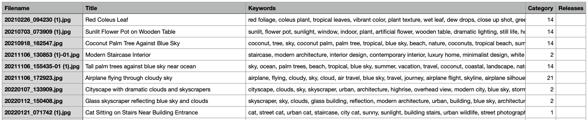

# Adobe Stock CSV Generator

A local tool that helps you create Adobe Stock CSV metadata from your photos, one image at a time, with safe resume behavior.

## Who This Is For

This README is written for photographers who are not deeply technical.

If you can:
- open LM Studio,
- open Terminal,
- copy-paste a command,

you can use this project.

## Beginner Quick Start (Recommended)

This path uses **LM Studio** and does **not** require an OpenAI API key.

### 1. Before you start

You need:
- macOS/Linux
- Python 3.10+
- LM Studio installed
- A vision model loaded in LM Studio (recommended: `qwen/qwen3-vl-8b`)
- Your images inside `Portfolio/`

### 2. Start LM Studio

1. Open LM Studio.
2. Load a vision model (for example `qwen/qwen3-vl-8b`).
3. Start Local Server.
4. Confirm it is reachable at `http://127.0.0.1:1234`.

Optional check:

```bash
curl http://127.0.0.1:1234/v1/models
```

### 3. Open Terminal in this project folder

Project folder example:

```text
/Users/administrator/Documents/Kiki/adobe_stock_csv_codex_kit
```

### 4. Run a small smoke test first (5 images)

Copy-paste:

```bash
python3 src/adobe_stock_csv_cli.py \
  --backend lmstudio \
  --lmstudio-host http://127.0.0.1:1234 \
  --lmstudio-model qwen/qwen3-vl-8b \
  --lmstudio-fallback-model google/gemma-3-4b \
  --lmstudio-category-model google/gemma-3-4b \
  --portfolio-dir Portfolio \
  --output-dir output/lmstudio/qwen-qwen3-vl-8b \
  --limit 5
```

### 5. Run the full batch

After smoke test looks good:

```bash
python3 src/adobe_stock_csv_cli.py \
  --backend lmstudio \
  --lmstudio-host http://127.0.0.1:1234 \
  --lmstudio-model qwen/qwen3-vl-8b \
  --lmstudio-fallback-model google/gemma-3-4b \
  --lmstudio-category-model google/gemma-3-4b \
  --portfolio-dir Portfolio \
  --output-dir output/lmstudio/qwen-qwen3-vl-8b
```

## What Happens During a Run

For each image, the tool does this safely:

1. Analyze 1 image
2. Validate metadata
3. Append exactly 1 CSV row
4. Flush to disk immediately
5. Continue

If something fails for one image, the batch continues.

## Resume and Recovery

You can stop and run again anytime.

- Already processed filenames are skipped.
- The tool does not restart from zero.
- Failed/uncertain files are logged for manual review.

## Where Output Files Are

Inside your selected `--output-dir`:

- `adobe_stock_upload.csv` (main upload CSV)
- `review_needed.csv` (items needing manual review)
- `progress.json` (run counters and benchmark summary)
- `run.log` (detailed run events)

## Output Example

Sample output view:



This screenshot was captured from this project's generated CSV output.

## Quick Quality Check (CSV structure)

```bash
python3 src/adobe_stock_csv_cli.py \
  --output-dir output/lmstudio/qwen-qwen3-vl-8b \
  --validate-only \
  --validate-lines 5
```

## What This Tool Is Good At

- Safe row-by-row writing
- Resume support for long runs
- Strict CSV validation before write
- Review queue for uncertain rows
- Benchmark visibility (speed and latency)

## What This Tool Does Not Guarantee

- Perfect title/keyword/category accuracy for every image
- Zero manual review effort
- Guaranteed Adobe acceptance for every asset

Human review is still expected before final Adobe submission.

## Basic Troubleshooting (Plain Language)

### "LM Studio quit unexpectedly"

- Reopen LM Studio manually.
- Make sure a model is loaded.
- Make sure Local Server is running.
- Re-run the same command; resume will skip completed files.

### "No output written"

- Check if model/server is running.
- Check `review_needed.csv` for reasons.
- Check `run.log` for error details.

### "Wrong categories on some images"

- This can happen with AI models.
- Use `review_needed.csv` and your manual pass before upload.

## Advanced / Developer Section

## Installation (packaged command)

### Option A: Local install with pip

```bash
python3 -m pip install .
```

Then use:

```bash
adobe-stock-csv --help
```

### Option B: Isolated install with pipx

```bash
pipx install .
```

Then use:

```bash
adobe-stock-csv --help
```

## Optional Backends

- `lmstudio` (default)
- `ollama`
- `openai`

## CSV Contract

Header is always:

```csv
Filename,Title,Keywords,Category,Releases
```

Validation includes:
- UTF-8, comma-delimited, standard quoting, LF newlines
- Required title and keywords
- Category numeric `1..21`
- `Releases` blank unless explicitly verified

## Testing

```bash
python3 -m unittest -q tests/test_adobe_stock_csv_cli.py
```

## Lightweight Contributor Fixture

A tiny fixture is provided for wiring checks:

```bash
python3 src/adobe_stock_csv_cli.py \
  --portfolio-dir fixtures/minimal \
  --output-dir /tmp/adobe-stock-csv-fixture-run \
  --limit 1 \
  --dry-run
```

## Internal Maintainer Docs

These remain public but are internal workflow aids:

- `AGENTS.md`
- `prompts/`

## License

MIT. See `LICENSE`.

This project is independent and not affiliated with Adobe.
